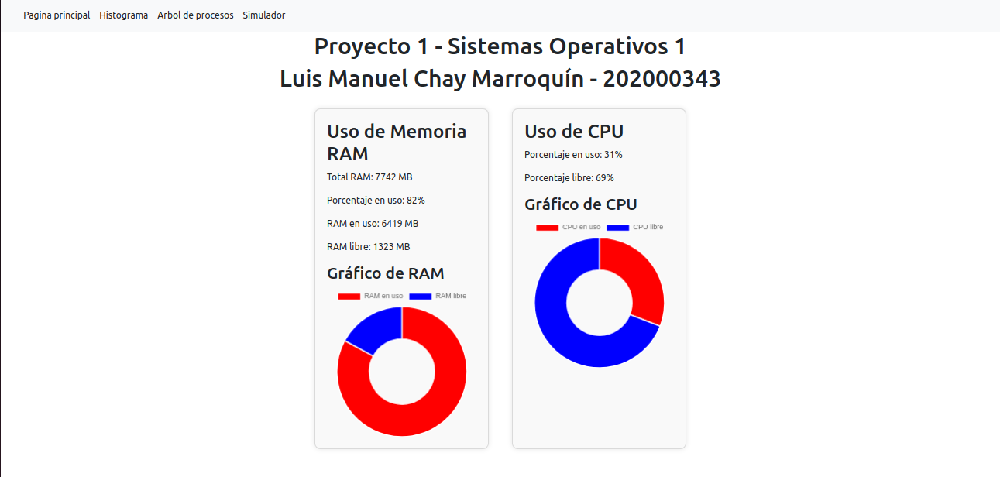
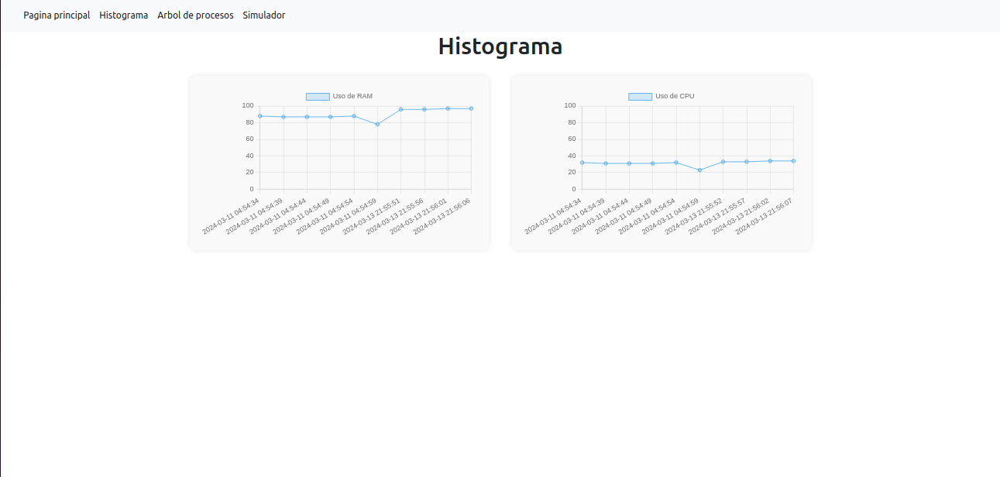
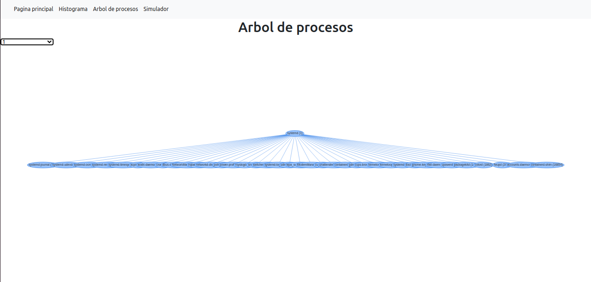
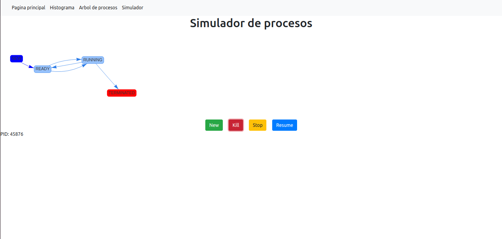

# PROYECTO 1 - SO1
**Luis Manuel Chay Marroquín // 202000343**

## MODULOS
### Ram
- **Descripción:** Módulo en lenguaje C encargado de obtener información de la memoria RAM del sistema.

```c
static int escribir_archivo(struct seq_file *archivo, void *v)
{
    struct sysinfo info;
    long total_memoria, memoria_libre, memoria_en_uso, porcentaje_en_uso;
    si_meminfo(&info);

    total_memoria = (info.totalram * info.mem_unit)/(1024*1024);
    memoria_libre = (info.freeram * info.mem_unit)/(1024*1024);
    memoria_en_uso = total_memoria - memoria_libre;
    porcentaje_en_uso = (memoria_en_uso * 100) / total_memoria;
    seq_printf(archivo, "{\n");
    seq_printf(archivo, "\"Total_Ram\": %lu,\n", total_memoria);
    seq_printf(archivo, "\"Ram_en_Uso\": %lu,\n", memoria_en_uso);
    seq_printf(archivo, "\"Ram_libre\": %lu,\n", memoria_libre);
    seq_printf(archivo, "\"Porcentaje_en_uso\": %lu\n", porcentaje_en_uso);
    seq_printf(archivo, "}\n");
    return 0;
}
```
- **Makefile:**
```makefile
obj-m += ram_so1_1s2024.o

all:
    make -C /lib/modules/$(shell uname -r)/build M=$(PWD) modules

clean:
    make -C /lib/modules/$(shell uname -r)/build M=$(PWD) clean

```

- **Compilación e inserción:** 
```bash
make
sudo insmod ram_so1_1s2024.ko
```

### Cpu
- **Descripción:** Módulo en lenguaje C encargado de obtener información de la CPU del sistema como su porcentaje de uso y procesos.

```c

static int calcularPorcentajeCpu(void)
{
    struct file *archivo;
    char lectura[256];

    int usuario, nice, system, idle, iowait, irq, softirq, steal, guest, guest_nice;
    int total;
    int porcentaje;

    archivo = filp_open("/proc/stat", O_RDONLY, 0);
    if (archivo == NULL)
    {
        printk(KERN_ALERT "Error al abrir el archivo");
        return -1;
    }

    memset(lectura, 0, 256);
    kernel_read(archivo, lectura, sizeof(lectura), &archivo->f_pos);

    sscanf(lectura, "cpu %d %d %d %d %d %d %d %d %d %d", &usuario, &nice, &system, &idle, &iowait, &irq, &softirq, &steal, &guest, &guest_nice);

    total = usuario + nice + system + idle + iowait + irq + softirq + steal + guest + guest_nice;

    porcentaje = (total - idle) * 100 / total;
    filp_close(archivo, NULL);

    return porcentaje;

}

static int escribir_archivo(struct seq_file *archivo, void *v)
{
    int porcentaje = calcularPorcentajeCpu();
    if (porcentaje == -1)
    {
        seq_printf(archivo, "Error al leer el archivo");
    }
    else
    {
        seq_printf(archivo, "{\n");
        seq_printf(archivo, "\"Porcentaje_en_uso\": %d,\n", porcentaje);
        seq_printf(archivo, "\"tasks\": [\n");
        struct task_struct* cpu_task;
        int ram, separador = 0;
        for_each_process(cpu_task)
        {
            if (separador){
                seq_printf(archivo, ",\n");
            }
            seq_printf(archivo, "{\n");
            seq_printf(archivo, "\"pid\": %d,\n", cpu_task->pid);
            seq_printf(archivo, "\"nombre\": \"%s\",\n", cpu_task->comm);
            seq_printf(archivo, "\"usuario\": %d,\n", cpu_task->cred->uid.val);
            seq_printf(archivo, "\"estado\": %d,\n", cpu_task->__state);
            if (cpu_task->mm)
            {
                ram = (get_mm_rss(cpu_task->mm)<<PAGE_SHIFT)/(1024*1024); // MB
                seq_printf(archivo, "\"ram\": %d,\n", ram);
            }
            seq_printf(archivo, "\"padre\": %d\n", cpu_task->parent->pid);
            seq_printf(archivo, "}\n");
            separador = 1;
            
        }
        seq_printf(archivo, "]\n");
        seq_printf(archivo, "}\n");
    }
    return 0;
}
```
- **Makefile:**
```makefile
obj-m += cpu_so1_1s2024.o

all:
    make -C /lib/modules/$(shell uname -r)/build M=$(PWD) modules
clean:
    make -C /lib/modules/$(shell uname -r)/build M=$(PWD) clean
```

- **Compilación e inserción:** 
```bash
make
sudo insmod cpu_so1_1s2024.ko
```

## BASE DE DATOS MYSQL
- **Descripción:** Base de datos que almacena la informacion de los modulos de RAM y CPU para registro historico
```sql
use p1_so1;

CREATE TABLE IF NOT EXISTS ram_historico (
    uso INT NOT NULL,
    fecha DATETIME NOT NULL
);

CREATE TABLE IF NOT EXISTS cpu_historico (
    uso INT NOT NULL,
    fecha DATETIME NOT NULL
);
```

## BACKEND GO
- **Descripción:** Backend en lenguaje Go que se encarga de obtener la información de los modulos de RAM y CPU y almacenarla en la base de datos, tambien envia la información al frontend al mismo tiempo.


```go
// Structs de almacenamiento de información
type Ram struct {
    Total      int `json:"Total_Ram"`
    En_uso     int `json:"Ram_en_Uso"`
    Libre      int `json:"Ram_libre"`
    Porcentaje int `json:"Porcentaje_en_uso"`
}

type Process struct {
    Pid     int    `json:"pid"`
    Nombre  string `json:"nombre"`
    Usuario int    `json:"usuario"`
    Estado  int    `json:"estado"`
    Ram     int    `json:"ram"`
    Padre   int    `json:"padre"`
}

type Cpu struct {
    Porcentaje int       `json:"Porcentaje_en_uso"`
    Procesos   []Process `json:"tasks"`
}

var ramInfo Ram
var cpuInfo Cpu

// GO ROUTINES
func main() {
    fmt.Println("Iniciando el servidor...")
    router := mux.NewRouter()
    enableCORS(router)

    // Inicializar los valores de ramInfo y cpuInfo
    updateRamInfo()
    updateCpuInfo() 

    // Configurar un ticker para enviar los datos cada 2 segundos
    ticker := time.NewTicker(2 * time.Second)
    defer ticker.Stop()

    // Goroutine para actualizar ramInfo y cpuInfo cada 2 segundos
    go func() {
        for {
            select {
            case <-ticker.C:
                updateRamInfo()
                updateCpuInfo()
            }
        }
    }()

    // Nueva goroutine para insertar datos en la base de datos cada 5 segundos
    go func() {
        insertTicker := time.NewTicker(5 * time.Second)
        defer insertTicker.Stop()
        for {
            select {
            case <-insertTicker.C:
                // Insertar datos en la base de datos
                err := insertRamInfoToDB(ramInfo)
                if err != nil {
                    fmt.Println("Error al insertar datos de RAM en la base de datos:", err)
                }

                err = insertCpuInfoToDB(cpuInfo)
                if err != nil {
                    fmt.Println("Error al insertar datos de CPU en la base de datos:", err)
                }
            }
        }
    }()
}

// Actualizar la información de la RAM
func updateRamInfo() {
    cmd := exec.Command("sh", "-c", "cat /proc/ram_so1_1s2024")
    out, err := cmd.CombinedOutput()
    if err != nil {
        fmt.Println("Error al obtener la información de RAM:", err)
        return
    }

    var ram Ram
    err = json.Unmarshal(out, &ram)
    if err != nil {
        fmt.Println("Error al analizar la información de RAM:", err)
        return
    }

    ramInfo = ram
}

// Actualizar la información de la CPU
func updateCpuInfo() {
    cmdCpu := exec.Command("sh", "-c", "cat /proc/cpu_so1_1s2024")
    outCpu, err := cmdCpu.CombinedOutput()
    if err != nil {
        fmt.Println("Error al obtener la información de CPU:", err)
        return
    }

    var cpuData struct {
        PorcentajeEnUso int       `json:"Porcentaje_en_uso"`
        Tasks           []Process `json:"tasks"`
    }
    err = json.Unmarshal(outCpu, &cpuData)
    if err != nil {
        fmt.Println("Error al analizar la información de CPU:", err)
        return
    }

    // Calcular el porcentaje de uso de la CPU
    var totalCPUUsage int
    for _, process := range cpuData.Tasks {
        totalCPUUsage += process.Ram
    }
    totalCPUTasks := len(cpuData.Tasks)
    if totalCPUTasks > 0 {
        cpuInfo.Porcentaje = totalCPUUsage / totalCPUTasks
    } else {
        cpuInfo.Porcentaje = 0
    }

    cpuInfo.Procesos = cpuData.Tasks
}

func updateCpuInfoHandler(w http.ResponseWriter, req *http.Request) {
    // Actualiza la información de la CPU y escribe la respuesta
    updateCpuInfo()

    // Convertir la estructura cpuInfo a JSON
    cpuJSON, err := json.Marshal(cpuInfo)
    if err != nil {
        fmt.Println("Error al convertir la información de CPU a JSON:", err)
        http.Error(w, "Error interno del servidor", http.StatusInternalServerError)
        return
    }

    // Escribir la respuesta JSON en el ResponseWriter
    w.Header().Set("Content-Type", "application/json")
    w.WriteHeader(http.StatusOK)
    w.Write(cpuJSON)
}

// Función para insertar datos de RAM en la base de datos
func insertRamInfoToDB(ram Ram) error {
    db, err := connectDB()
    if err != nil {
        return err
    }
    defer db.Close()

    query := "INSERT INTO ram_historico (uso, fecha) VALUES (?, ?)"
    _, err = db.Exec(query, ram.Porcentaje, time.Now())
    if err != nil {
        return err
    }
    return nil
}

// Función para insertar datos de CPU en la base de datos
func insertCpuInfoToDB(cpu Cpu) error {
    db, err := connectDB()
    if err != nil {
        return err
    }
    defer db.Close()

    query := "INSERT INTO cpu_historico (uso, fecha) VALUES (?, ?)"
    _, err = db.Exec(query, cpu.Porcentaje, time.Now())
    if err != nil {
        return err
    }
    return nil
}

// Función para obtener los últimos 10 datos de RAM de la base de datos
func getRecentRamDataFromDB() ([]byte, error) {
    db, err := connectDB()
    if err != nil {
        return nil, err
    }
    defer db.Close()

    query := "SELECT uso, fecha FROM ram_historico ORDER BY fecha DESC LIMIT 10"
    rows, err := db.Query(query)
    if err != nil {
        return nil, err
    }
    defer rows.Close()

    // Crear una estructura para almacenar los resultados
    var ramData []struct {
        Uso   int       `json:"uso"`
        Fecha time.Time `json:"fecha"`
    }

    // Iterar sobre las filas y guardar los datos en la estructura
    for rows.Next() {
        var uso int
        var fecha time.Time
        err := rows.Scan(&uso, &fecha)
        if err != nil {
            return nil, err
        }
        ramData = append(ramData, struct {
            Uso   int       `json:"uso"`
            Fecha time.Time `json:"fecha"`
        }{uso, fecha})
    }

    // Convertir los datos a formato JSON
    jsonData, err := json.Marshal(ramData)
    if err != nil {
        return nil, err
    }

    return jsonData, nil
}

// Función para obtener los últimos 10 datos de CPU de la base de datos
func getRecentCpuDataFromDB() ([]byte, error) {
    db, err := connectDB()
    if err != nil {
        return nil, err
    }
    defer db.Close()

    query := "SELECT uso, fecha FROM cpu_historico ORDER BY fecha DESC LIMIT 10"
    rows, err := db.Query(query)
    if err != nil {
        return nil, err
    }
    defer rows.Close()

    // Crear una estructura para almacenar los resultados
    var cpuData []struct {
        Uso   int       `json:"uso"`
        Fecha time.Time `json:"fecha"`
    }

    // Iterar sobre las filas y guardar los datos en la estructura
    for rows.Next() {
        var uso int
        var fecha time.Time
        err := rows.Scan(&uso, &fecha)
        if err != nil {
            return nil, err
        }
        cpuData = append(cpuData, struct {
            Uso   int       `json:"uso"`
            Fecha time.Time `json:"fecha"`
        }{uso, fecha})
    }

    // Convertir los datos a formato JSON
    jsonData, err := json.Marshal(cpuData)
    if err != nil {
        return nil, err
    }

    return jsonData, nil
}
```

## FRONTEND REACT
- **Descripción:** Frontend en lenguaje React que se encarga de mostrar la información de los modulos de RAM y CPU y mostrar la información historica de la base de datos.

### Pagina principal (Monitoreo en tiempo real)

- **Descripcion**: Muestra la información en tiempo real de la RAM y CPU del sistema.



### Histograma

- **Descripcion**: Muestra la información historica de la RAM y CPU del sistema.



### Arbol de procesos

- **Descripcion**: Muestra la información de los procesos corriendo a tiempo real del sistema. Cuenta con un selectbox para elegir los PID de los procesos y mostrar su arból de procesos.



### Simulador

- **Descripcion**: Simulador de procesos Linux y sus estados que puede tomar



## DOCKER

- **Descripcion**: Se utilizo docker para empaquetar el backend, frontend y base de datos en contenedores separados y poder desplegarlos en un servidor en Ubuntu Server.

### Repositorios Docker
- **Backend:**
[Backend](https://hub.docker.com/repository/docker/luischay/backendpo1-so1/)
- **Frontend:**
[Frontend](https://hub.docker.com/repository/docker/luischay/frontendpo1-so1/)

### Dockerfiles
- **Dockerfile Backend:**
```dockerfile
FROM golang:1.22-alpine

WORKDIR /backend

COPY go.mod .
COPY go.sum .

RUN go mod download

COPY . .

RUN go build -o app .

EXPOSE 5000

CMD ["./app"]
```

- **Dockerfile Frontend:**
```dockerfile
FROM node:18.15-alpine

WORKDIR /frontend

COPY package.json ./
COPY package-lock.json ./

RUN npm install 

COPY . ./

EXPOSE 3000

CMD ["npm", "start"]
```
### Docker-compose

- **docker-compose.yml:**
```yaml
version: '3'

services:
  mysql:
    image: 'mysql'
    container_name: 'mysqlcontain'
    restart: always
    environment:
      MYSQL_ROOT_PASSWORD: 'root'
      MYSQL_DATABASE: 'p1_so1'
      MYSQL_PASSWORD: 'root'
    volumes:
      - base_mysql:/var/lib/mysql      
    ports:
      - '3306:3306'

  backend:
    image: 'luischay/backendpo1-so1'
    restart: always
    environment:
      DB_USER: 'root'
      DB_PASSWORD: 'root'
      DB_HOST: 'mysqlcontain'
      DB_PORT: '3306'
      DB_NAME: 'p1_so1'
    volumes:
      - type: bind
        source: /proc
        target: /proc
      - /proc:/proc
      - /etc/passwd:/etc/passwd
    pid: host
    user: root
    privileged: true
    ports:
      - '5000:5000'
    depends_on:
      - mysql

  frontend:
    image: 'luischay/frontendpo1-so1'
    ports:
      - '3000:3000'
    restart: always

  nginx:
    container_name: 'nginxcontain' 
    image: 'nginx'
    depends_on:
      - backend
      - frontend
    volumes:
      - ./default.conf:/etc/nginx/conf.d/default.conf
    ports:
      - '80:80' 

volumes:
  base_mysql:
```
### Despliegue
- **Comando:**
```bash
docker-compose up -d --build
docker-compose down
```

## PROXYS
- **Descripcion**: Se utilizo nginx como proxy para redirigir las peticiones al backend y frontend.

### default.conf
```nginx
server {
  listen 80 default_server;

  server_name _;
  location /api {
            rewrite ^/api(/.*)$ $1 break;

            proxy_pass http://backend:5000; # Reemplaza 3000 con el puerto de tu backend
            proxy_set_header Host $host;
            proxy_set_header X-Real-IP $remote_addr;
            proxy_set_header X-Forwarded-For $proxy_add_x_forwarded_for;
            proxy_set_header X-Forwarded-Proto $scheme;
    }

    location / {
            proxy_pass http://frontend:3000; # Reemplaza 80 con el puerto de tu frontend
            proxy_set_header Host $host;
            proxy_set_header X-Real-IP $remote_addr;
            proxy_set_header X-Forwarded-For $proxy_add_x_forwarded_for;
            proxy_set_header X-Forwarded-Proto $scheme;
    }

}
``` 