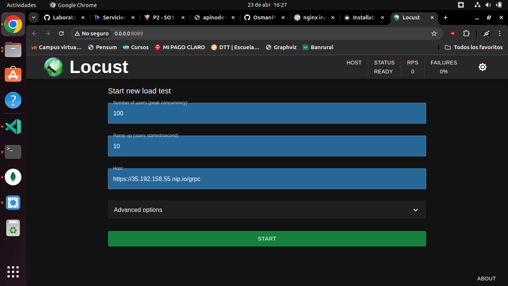
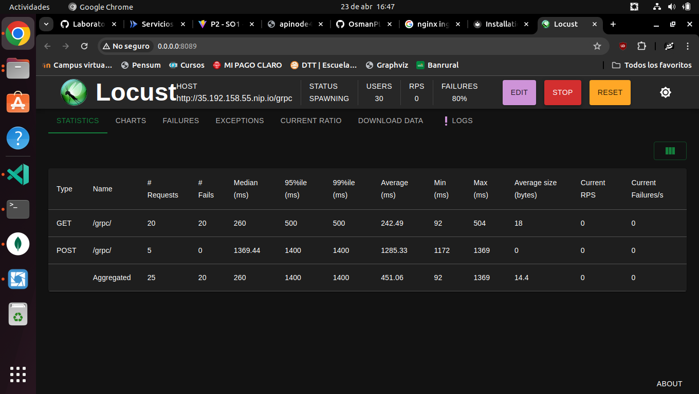
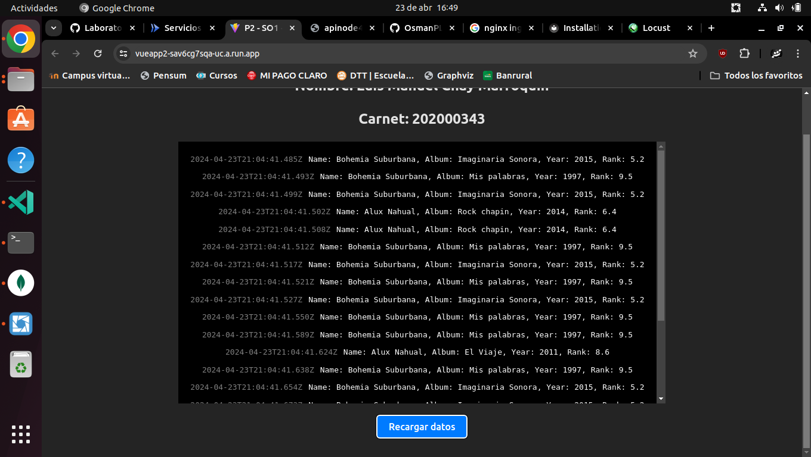
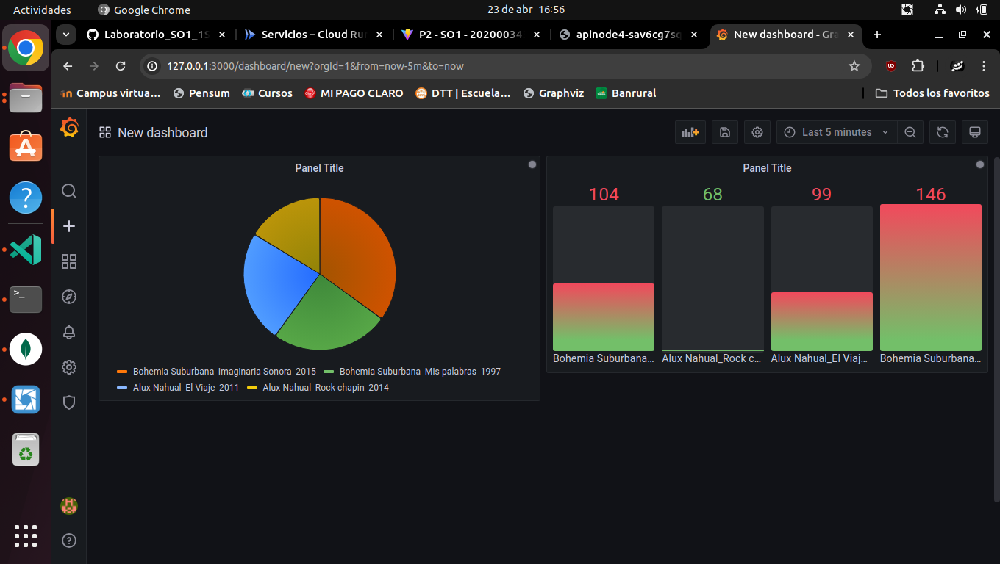

# PROYECTO 2 - SO1
- **Nombre:** Luis Manuel Chay Marroquín
- **Carné:** 202000343

## Introducción
En este proyecto se desarrolló una aplicación que simula un sistema de monitoreo de votos en tiempo real. La aplicación se compone de varios servicios que se comunican entre sí en un ambiente de Kubernetes y Google Cloud Run. La aplicación se desarrollo haciendo uso de tecnologias como gRPC, Golang, Rust, Kafka, Redis, MongoDB, Locust, Grafana y Google Cloud Run y todo el ecosistema de integración de servicios en Kubernetes.
Permite cargar votos para obtener estadísticas en tiempo real de los votos realizados. Se implementó un sistema de monitoreo de votos que permite visualizar los votos en tiempo real. Se desplegaron aplicaciones serverless en Google Cloud Run que usan los servicios desplegados en Kubernetes.

## Objetivos
### Objetivo General
Desarrollar una aplicacion que permita la comunicación entre distintos servicios en un ambiente de Kubernetes, con el fin de interactuar y conocer el entorno de despliegue de aplicaciones en la nube.

### Objetivos Específicos
- Implementar despliegues y servicios en Kubernetes de servicios creados por el desarrollador o servicios de terceros.
- Implementar un sistema de monitoreo de votos que permita la visualización de datos en tiempo real.
- Desplegar aplicaciones serverless en Google Cloud Run que usen los servicios desplegados en Kubernetes.

## Tecnologías usadas
- **Kubernetes:** Es un sistema de código abierto para la automatización del despliegue, escalado y manejo de aplicaciones en contenedores.
- **Locust:** Es una herramienta desarrollada en Python de prueba de carga que permite simular el comportamiento de los usuarios en un sistema.
- **Ingress:** Es un recurso de Kubernetes que permite exponer servicios HTTP y HTTPS a través de una dirección IP haciendo uso de NGINX.
- **gRPC:** Es un framework de comunicación de procedimientos remotos de código abierto desarrollado por Google.
- **Kafka:** Es una plataforma de transmisión de mensajes distribuida que permite publicar, suscribirse, almacenar y procesar flujos de registros en tiempo real.
- **MongoDB:** Es una base de datos NoSQL orientada a documentos de código abierto que almacena datos en documentos flexibles similares a JSON.
- **Redis:** Es un almacén de estructura de datos en memoria de código abierto utilizado como base de datos, caché y agente de mensajes.
- **Grafana:** Es una plataforma de análisis y visualización de métricas de código abierto de facil implementación con Redis.
- **Google Cloud Run:** Es un servicio de Google Cloud que permite ejecutar contenedores de manera serverless.

## Deployments y servicios K8S
### Namespace
Se creó un namespace llamado `so1-p2` para desplegar todos los servicios.
**Manifiesto de Namespace:**
```bash
apiVersion: v1
kind: Namespace
metadata:
  name: so1-p2
```
### Ingress
Se creó un archivo `ingress.app.yaml` para exponer los servicios de la aplicación.
**Instalación de Ingress Controller:**
```bash
kubectl apply -f https://raw.githubusercontent.com/kubernetes/ingress-nginx/controller-v1.10.1/deploy/static/provider/cloud/deploy.yaml
```
**Manifiesto de Ingress:**
```bash
apiVersion: networking.k8s.io/v1
kind: Ingress
metadata:
  name: ingress-grpc
  annotations:
    nginx.ingress.kubernetes.io/rewrite-target: /insert
  namespace: so1-p2
spec:
  ingressClassName: nginx
  rules:
  - http:
      paths:
      - path: /grpc
        pathType: Prefix
        backend:
          service:
            name: service-grpc
            port:
              number: 5000
```
### Golang gRPC deployment
Se creó un archivo `grcpdeploy.yaml` para desplegar el servicio gRPC en Kubernetes, incluye dos imagenes de contenedores, una para el cliente y otra para el servidor creadas por mi persona con su respectivo Service
**Deployment:**
```bash
apiVersion: apps/v1
kind: Deployment
metadata:
  name: deploymentgrpc
  namespace: so1-p2
spec:
  selector:
    matchLabels:
      role: deploymentgrpc
  replicas: 1
  template:
    metadata:
      labels:
        role: deploymentgrpc
    spec:
      containers:
      - name: containclient
        image: luischay/grpcclient
        ports:
        - containerPort: 5000
      - name: containserver
        image: luischay/grpcserver1
        ports:
        - containerPort: 5001
```
**Service:**
```bash

apiVersion: v1
kind: Service
metadata:
  name: service-grpc
spec:
  ports:
  - name: grpc-client
    port: 5000
    targetPort: 5000
  # - name: grpc-server
  #   port: 5001
  #   targetPort: 5001
  selector:
    role: deploymentgrpc
  type: LoadBalancer  
```
### Kafka
Se desplegó Kafka en Kubernetes con Strimzi, se creó un archivo `kafka.yaml` para desplegar el cluster de Kafka y configurarlo para las necesidades del proyecto y un archivo `kafkatopic.yaml` para crear un tópico en Kafka.
**Instalación de Strimzi:**
```bash
kubectl apply -f https://strimzi.io/install/latest?namespace=so1-p2 -n so1-p2
```
**Manifiesto de Kafka:**
```bash
apiVersion: kafka.strimzi.io/v1beta2
kind: Kafka
metadata:
  name: my-cluster
spec:
  kafka:
    version: 3.7.0
    replicas: 1
    listeners:
      - name: plain
        port: 9092
        type: internal
        tls: false
      - name: tls
        port: 9093
        type: internal
        tls: true
    config:
      offsets.topic.replication.factor: 1
      transaction.state.log.replication.factor: 1
      transaction.state.log.min.isr: 1
      default.replication.factor: 1
      min.insync.replicas: 1
      inter.broker.protocol.version: "3.7"
    storage:
      type: jbod
      volumes:
      - id: 0
        type: persistent-claim
        size: 1Gi
        deleteClaim: false
  zookeeper:
    replicas: 1
    storage:
      type: persistent-claim
      size: 1Gi
      deleteClaim: false
  entityOperator:
    topicOperator: {}
    userOperator: {}
```
**Manifiesto de Kafka Topic:**
```bash
apiVersion: kafka.strimzi.io/v1beta2
kind: KafkaTopic
metadata:
  name: votes-submitted
  labels:
    strimzi.io/cluster: my-cluster
spec:
  partitions: 1
  replicas: 1
  config:
    retention.ms: 7200000
```
### Consumer Kafka Go
Se creó un archivo `consumergodeploy.yaml` para desplegar el consumidor de Kafka en Go programado por mi persona junto con su respectivo autoscaler con un maximum de 5 replicas y un minimum de 2 replicas.
**Deployment:**
```bash
apiVersion: apps/v1
kind: Deployment
metadata:
  name: kafka-consumer
spec:
  replicas: 2
  selector:
    matchLabels:
      app: kafka-consumer
  template:
    metadata:
      labels:
        app: kafka-consumer
    spec:
      containers:
      - name: consumer
        image: luischay/consumerkafka9
```
**Autoscaler:**
```bash
apiVersion: autoscaling/v1
kind: HorizontalPodAutoscaler
metadata:
  name: kafka-consumer-autoscaler
spec:
  scaleTargetRef:
    apiVersion: apps/v1
    kind: Deployment
    name: kafka-consumer
  minReplicas: 2
  maxReplicas: 5
  targetCPUUtilizationPercentage: 5
```
### MongoDB
Se creó un archivo `mongo-deployment.yaml` para desplegar la base de datos MongoDB haciendo uso de su imagen oficial en Kubernetes junto a su respectivo service de tipo LoadBalancer para poder accedido por diferentes clientes o aplicaciones.
**Deployment:**
```bash
apiVersion: apps/v1
kind: Deployment
metadata:
  name: mongodb-deployment
spec:
  replicas: 1
  selector:
    matchLabels:
      app: mongodb
  template:
    metadata:
      labels:
        app: mongodb
    spec:
      containers:
        - name: mongodb
          image: mongo:latest
          ports:
            - containerPort: 27017
```
**Service:**
```bash
apiVersion: v1
kind: Service
metadata:
  name: mongodb-service
spec:
  selector:
    app: mongodb
  ports:
    - protocol: TCP
      port: 27017
      targetPort: 27017
  type: LoadBalancer
```
### Redis
Se creó un archivo `redis-deployment.yaml` para desplegar la base de datos Redis haciendo uso de su imagen oficial en Kubernetes junto a su respectivo service de tipo LoadBalancer para poder accedido por diferentes clientes o aplicaciones.
**Deployment:**
```bash
apiVersion: apps/v1
kind: Deployment
metadata:
  name: redis-deployment
spec:
  replicas: 1
  selector:
    matchLabels:
      app: redis
  template:
    metadata:
      labels:
        app: redis
    spec:
      containers:
      - name: redis
        image: redis:latest
        ports:
        - containerPort: 6379
``` 
**Service:**
```bash
apiVersion: v1
kind: Service
metadata:
  name: redis-service
spec:
  selector:
    app: redis
  ports:
  - protocol: TCP
    port: 6379
    targetPort: 6379
  type: LoadBalancer
```

### Grafana
Se creó un archivo `grafana.yaml` para desplegar el servicio de Grafana en Kubernetes junto con su respectivo service de tipo LoadBalancer para poder accedido por diferentes clientes o aplicaciones y junto a su respectivo ConfigMap para configurar Grafana.
**ConfigMap:**
```bash
apiVersion: v1
kind: ConfigMap
metadata:
  name: grafana-datasources
  namespace: so1-p2
data:
  prometheus.yaml: |-
    {
        "apiVersion": 1,
        "datasources": [
            {
               "access":"proxy",
                "editable": true,
                "name": "redis",
                "orgId": 1,
                "password":"YOUR_PASSWORD",
                "type": "redis",
                "url": "redis://redis-service.so1-p2.svc.cluster.local:6379",
                "version": 1
            }
        ]
    }
```
**Deployment:**
```bash
apiVersion: apps/v1
kind: Deployment
metadata:
  name: grafana
  namespace: so1-p2
spec:
  replicas: 1
  selector:
    matchLabels:
      app: grafana
  template:
    metadata:
      name: grafana
      labels:
        app: grafana
    spec:
      containers:
      - name: grafana
        image: grafana/grafana:8.4.4
        ports:
        - name: grafana
          containerPort: 3000
        resources:
#          limits:
#            memory: "1Gi"
#            cpu: "1000m"
          requests:
            memory: 200M
            cpu: "200m"
        volumeMounts:
          - mountPath: /var/lib/grafana
            name: grafana-storage
          - mountPath: /etc/grafana/provisioning/datasources
            name: grafana-datasources
            readOnly: false
      volumes:
        - name: grafana-storage
          emptyDir: {}
        - name: grafana-datasources
          configMap:
              defaultMode: 420
              name: grafana-datasources
```
**Service:**
```bash
apiVersion: v1
kind: Service
metadata:
  creationTimestamp: null
  labels:
    app: grafana
  name: grafana
  namespace: so1-p2
spec:
  ports:
  - port: 3000
    protocol: TCP
    targetPort: 3000
  selector:
    app: grafana
  type: ClusterIP
```
Para acceder a Grafana se debe hacer un port-forwarding al puerto 3000 del servicio de Grafana.
```bash
kubectl port-forward -n so1-p2 --address 0.0.0.0 svc/grafana 3000:3000
```


## Ejemplos
### Carga de datos con Locust
Carga de datos a la ruta `/grpc` 


Proceso realizado correctamente


JSON de carga de datos (Se uso un archivo con 1000 registros)
```json
[
    {
        "name": "Bohemia Suburbana",
        "album": "Mis palabras",
        "year": "1997",
        "rank": "9.5"
    },
    {
        "name": "Alux Nahual",
        "album": "Rock chapin",
        "year": "2014",
        "rank": "6.4"
    },
]
```

### Visualización de datos de MongoDB en Vue


### Visualización de datos de Redis en Grafana



## Conclusiones
- Al lograr una implementación correcta de Kubernetes, se proporciona una infraestructura escalable y flexible que permite la gestión eficiente de servicios tanto propios como de terceros. La implementación exitosa en Kubernetes facilita la automatización del despliegue, la escalabilidad horizontal y la gestión de recursos, lo que conduce a una mayor agilidad y eficiencia en el desarrollo y despliegue de aplicaciones.
- La implementación exitosa de este sistema permite una toma de decisiones informada y una respuesta rápida a eventos inesperados durante el proceso de votación, mejorando así la transparencia y la confiabilidad del sistema.
-  Al lograr una despliegue con Cloud Run, se aprovecha lo mejor de ambos mundos: la escalabilidad y flexibilidad de Kubernetes para servicios más complejos y la simplicidad y eficiencia de las aplicaciones serverless para cargas de trabajo más ligeras y puntuales. La implementación exitosa de esta integración permite optimizar los costos y recursos, además de proporcionar una infraestructura ágil y adaptable que puede satisfacer una variedad de necesidades de aplicación.